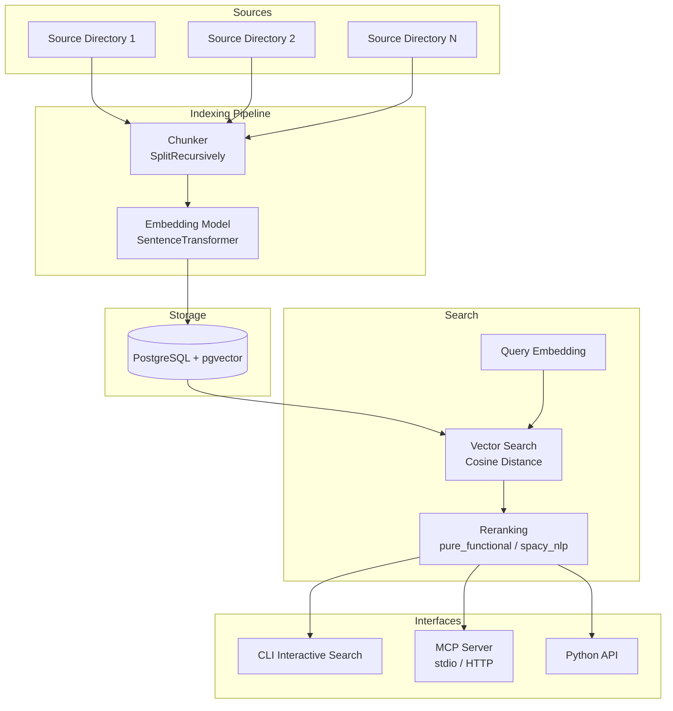
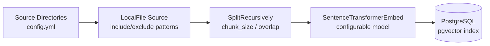
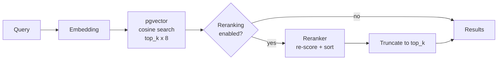
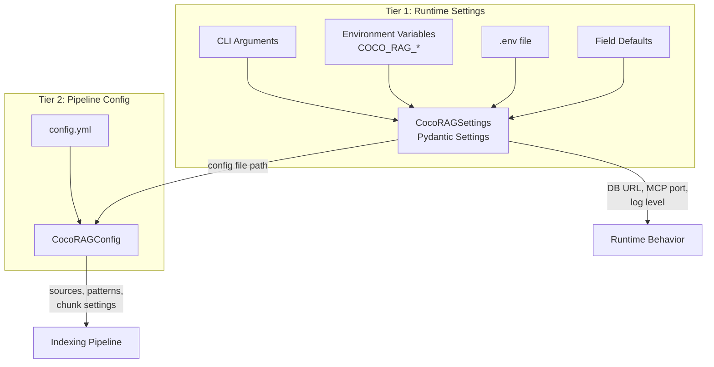

# CocoRAG Architecture

High-level architecture overview of CocoRAG, a semantic code search and
indexing system.

## System Overview

CocoRAG indexes source code into a PostgreSQL vector database and provides
semantic search through multiple interfaces. It uses embedding models to convert
code into vectors, pgvector for similarity search, and a pluggable reranking
system to improve result quality.



## Components

### Indexing Pipeline (`flow.py`)

Reads source files, splits them into overlapping chunks, generates embedding
vectors, and stores everything in PostgreSQL.



Key properties:
- **Incremental processing**: Only changed files are re-indexed via
  `FlowLiveUpdater`
- **Single table**: All sources go into one table with a `topic` column for
  filtering
- **Configurable chunking**: Chunk size, overlap, and minimum size are
  controlled via config

### Search Engine (`vector_search.py`)

Generates a query embedding using the same model, runs cosine distance search
against pgvector, and optionally applies reranking.



When reranking is enabled, additional candidates are fetched from the database
to give the reranker a larger pool to work with.

### Reranking System (`rerankers/`)

Pluggable reranking layer with multiple implementations behind a unified
interface. See [reranker-design.md](reranker-design.md) for full details.

### MCP Server (`mcp_server.py`)

FastMCP server exposing search capabilities to AI assistants via stdio or HTTP
transport. Provides 5 tools:

| Tool | Description |
|------|-------------|
| `search` | Semantic search with source/topic filter (source takes priority) and reranker selection |
| `list_topics` | Lists all indexed topics (topics can be shared by multiple sources) |
| `list_sources` | Lists all indexed sources (unique identifiers for each codebase) |
| `get_file` | Retrieves full file content with source/topic filter (reassembled from chunks) |
| `list_files` | Browses indexed files with source/topic filter and glob pattern filtering |

### CLI (`main.py`)

Typer-based command-line interface:

| Command | Description |
|---------|-------------|
| `coco-rag` | Interactive search mode with Rich UI |
| `coco-rag setup` | Create DB schema and flow infrastructure |
| `coco-rag update` | Run incremental indexing |
| `coco-rag drop` | Drop all backend resources |
| `coco-rag mcp` | Start MCP server |

## External Dependencies

| Dependency | Role |
|-----------|------|
| PostgreSQL + pgvector | Vector database for embeddings and code chunks |
| CocoIndex | Indexing framework (incremental processing, chunking, embedding) |
| sentence-transformers | Embedding model (default: `all-MiniLM-L6-v2`) |
| psycopg + psycopg_pool | Database driver with connection pooling |
| FastMCP | MCP server framework |
| spaCy (optional) | NLP reranking via `en_core_web_sm` model |

## Configuration

CocoRAG uses a two-tier configuration system:



### Tier 1: Runtime Settings (`settings.py`)

Pydantic Settings with layered precedence:

```
CLI arguments > Environment variables (COCO_RAG_*) > .env file > Defaults
```

Manages: database URL, MCP transport/host/port, log level, reranking
settings, embedding model, chunk sizes.

### Tier 2: Data Pipeline Config (`config.yml`)

YAML file defining source directories, file patterns, and pipeline settings:

```yaml
defaults:
  included_patterns: ["*.py", "*.ts", ...]
  excluded_patterns: ["**/node_modules/**", ...]

sources:
  - name: "my_project"
    topic: "my_project"
    type: "local_file"
    path: "/path/to/source"

settings:
  chunk_size: 1000
  embedding_model: "sentence-transformers/all-MiniLM-L6-v2"
```

Config file path resolution: `--config` flag > `COCO_RAG_CONFIG` env var >
`./config.yml`.

## Data Model

All indexed data lives in a single PostgreSQL table (default: `coco_rag`):

| Column | Type | Description |
|--------|------|-------------|
| `source_name` | text | Source identifier (primary key part) |
| `filename` | text | Relative file path (primary key part) |
| `location` | text | Chunk location within file (primary key part) |
| `topic` | text | Topic label for filtering |
| `code` | text | Chunk content |
| `embedding` | vector | Float32 embedding vector |
| `start` | jsonb | Start position (line, column) |
| `end` | jsonb | End position (line, column) |

A cosine similarity vector index is created on the `embedding` column for
efficient nearest-neighbor search.
